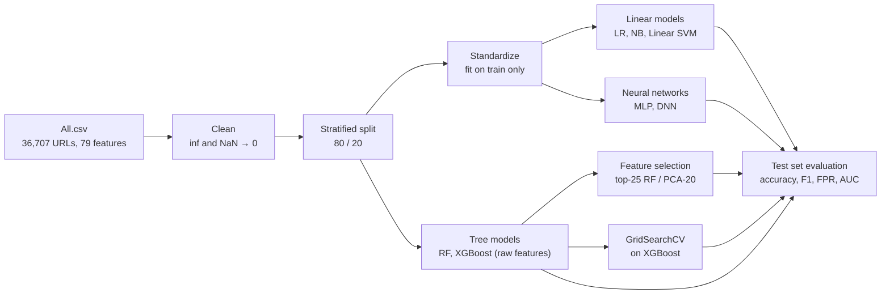

# Malicious URL Detection with ML and Deep Learning

A multi-class classifier for malicious URLs on the ISCX-URL2016 dataset. Each URL is
classified as benign, phishing, malware, defacement or spam from its pre-extracted lexical
features.

The notebook builds and compares seven models, from simple linear baselines to gradient
boosting and neural networks, then studies feature selection and hyperparameter tuning.

## Results

Stratified 80/20 split (29,365 URLs for training, 7,342 for testing), macro-averaged metrics
on the test set:

| Model | Accuracy | Macro F1 | Macro FPR | Macro AUC |
|---|---|---|---|---|
| **XGBoost (tuned)** | **98.60%** | **0.9860** | **0.35%** | 0.9996 |
| XGBoost | 98.56% | 0.9857 | 0.36% | 0.9996 |
| XGBoost (top-25 RF features) | 98.26% | 0.9828 | 0.44% | 0.9993 |
| Random Forest | 97.71% | 0.9774 | 0.58% | 0.9991 |
| XGBoost (PCA, 20 components) | 96.38% | 0.9641 | 0.91% | 0.9978 |
| DNN (deeper) | 95.56% | 0.9562 | 1.12% | 0.9969 |
| MLP | 95.30% | 0.9536 | 1.18% | 0.9964 |
| Logistic Regression | 85.43% | 0.8541 | 3.65% | 0.9760 |
| Linear SVM | 83.91% | 0.8381 | 4.04% | — |
| Naive Bayes | 57.12% | 0.5417 | 10.86% | 0.8591 |

Per-class results for the tuned XGBoost (`learning_rate=0.05`, `max_depth=8`,
`n_estimators=500`):

| Class | Precision | Recall | F1 |
|---|---|---|---|
| Defacement | 0.9937 | 0.9924 | 0.9931 |
| Benign | 0.9879 | 0.9942 | 0.9910 |
| Malware | 0.9903 | 0.9866 | 0.9884 |
| Phishing | 0.9646 | 0.9710 | 0.9678 |
| Spam | 0.9947 | 0.9851 | 0.9899 |

Tree ensembles clearly beat the other models on these lexical features, and tuning only adds
a little over the default XGBoost. Keeping 25 of the 79 features costs about 0.3 points of
accuracy. Phishing is the hardest class, as expected. Linear SVM has no ROC-AUC because
`LinearSVC` does not output probabilities.

## How it works



The features are already extracted from the URLs (lengths, counts of digits and symbols,
entropy, ...), so the work is about choosing and comparing classifiers. Everything that
learns from the data (label encoder, scaler, feature selection, class weights) is fitted on
the training set only, and the test set is used once, for the final scores. The five classes
are close in size (6,698 to 7,930 URLs), and the models still use balanced class weights. The
macro False Positive Rate is reported next to accuracy because a false positive means
blocking a legitimate site.

## What the notebook covers

1. **Data loading and cleaning** — label column detection, handling of NaN and infinite
   values
2. **Label encoding and stratified 80/20 split**
3. **Evaluation utilities** — accuracy, precision, recall, F1, ROC-AUC and False Positive
   Rate per model
4. **Machine learning models**, with balanced class weights (except Naive Bayes, which has
   no such option) to keep the False Positive Rate low on every class
   - Logistic Regression
   - Gaussian Naive Bayes
   - Linear SVM
   - Random Forest
   - XGBoost
5. **Deep learning models** (TensorFlow / Keras)
   - MLP
   - Deeper DNN with batch normalization
6. **Feature selection** — Random Forest importance (top-K features) and PCA
7. **Hyperparameter tuning** — GridSearchCV on XGBoost
8. **Final model comparison**
9. **Saving the model and running inference** on a sample from the test set

## Repository contents

| File | Description |
|---|---|
| `malicious_url_detection.ipynb` | The notebook, with outputs and figures |
| `requirements.txt` | Python dependencies |

## Dataset

[ISCX-URL2016](https://www.unb.ca/cic/datasets/url-2016.html) from the Canadian Institute for
Cybersecurity. The notebook uses `All.csv`: 36,707 URLs with 79 pre-extracted lexical
features and a class label. The dataset is not included in this repository; download it from
the link above.

## Run it

The results above come from a run on Kaggle with a GPU. On Kaggle, add a dataset containing
`All.csv` with "+ Add Input"; the notebook finds the file under `/kaggle/input/` by itself.

Locally: place `All.csv` next to the notebook, then

```bash
pip install -r requirements.txt
jupyter notebook malicious_url_detection.ipynb
```

## Tech stack

Python, scikit-learn, XGBoost, TensorFlow / Keras, pandas, NumPy, Matplotlib, Seaborn.

## About the project

Mini project for the **Data Security** (Sécurité des Données) module, 2SC IASD, École
Supérieure en Informatique de Sidi Bel Abbès (2025/2026).

This is the baseline study for the project. The second part, H-GATE, is a stacked ensemble
with an FT-Transformer and Harris Hawks Optimization, evaluated with 5-fold cross-validation
instead of a single split: see
[hgate-malicious-url-detection](https://github.com/Inesaini/hgate-malicious-url-detection).
